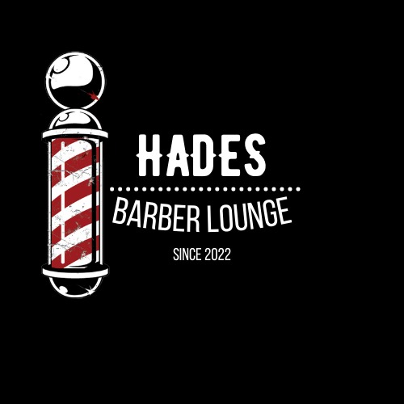
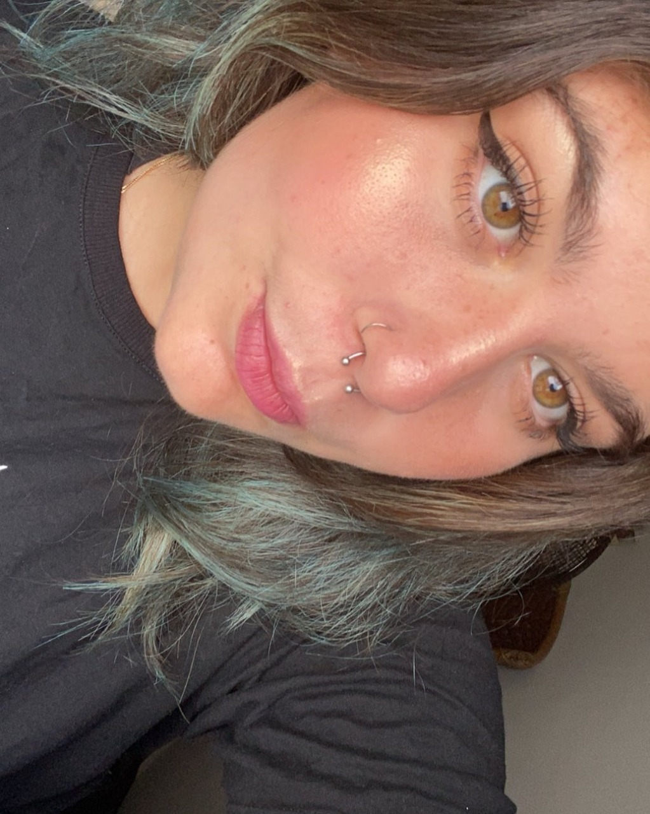
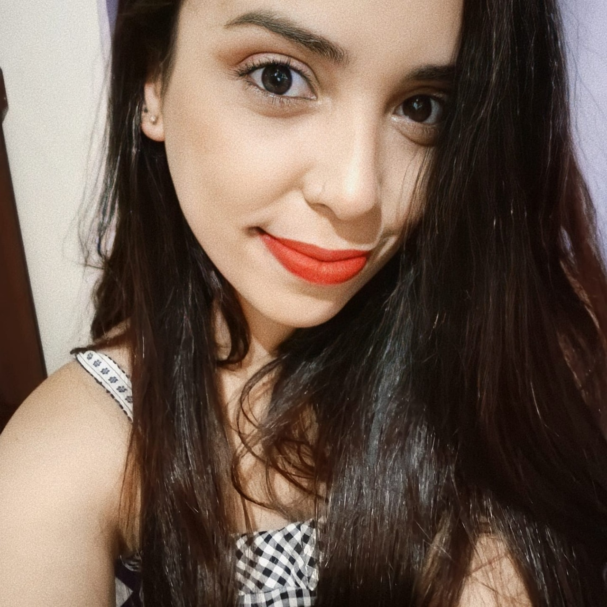

<p align="center">
    
</p>
<h1 align="center">Hades | Barber Lounge</h1>

<h4 align="center"> 
	🚧  Hades ❤️‍🔥 Em andamento 🚀 🚧
</h4>

<p align="center">
    <a href="#-sobre-o-projeto">Sobre</a> •
    <a href="#-icones">Ícones</a> •
    <a href="#-funcionalidades">Funcionalidades</a> •
    <a href="#-layout">Layout</a> • 
    <a href="#-como-executar-o-projeto">Como executar</a> • 
    <a href="#-tecnologias">Tecnologias</a> • 
    <a href="#-autores">Autores</a> • 
    <a href="#user-content--licença">Licença</a>
</p>

## 💻 Sobre o Projeto
❤️‍🔥 Hades | Barber Lounge -Atuando desde 2022 e se esforçando para a total satifação do cliente seja em corte, barba ou qualquer outro procedimento estético, do começo ao fim. Nós ofeecemos uma gama de serviços com muitos produtos de qualidade e a cada dia estamos crescendo mais no ramo.

Projeto com finalidade de aprimorar as habilidades voltadas para desenvolvimento front-end.

---

## 🗂️ Ícones
- :package: nova funcionalidade
- :up: atualização
- :beetle: correção de bug
- :checkered_flag: release

---

## ⚙️ Funcionalidades

### Site Institucional
- [x] Os usuários tem acesso ao site por meio do computador ou celular, onde podem:
    - [x] acesso a todos os serviços oferecidos e seus respectivos preços com possibilidade de agendamento em nossa plataforma.
    - [x] navegar pelo mapa para ver onde se localiza nossa barbearia.
    - [x] entrar em contato com a entidade através do E-mail ou do WhatsApp.
    - [x] acesso a produtos disponiveis para compra.
    - [x] definir o tema claro ou escuro no seu navegador.

---

## 🎨 Layout

O layout da aplicação está disponível no Figma:

<a href="https://www.figma.com/file/D41nbP0LDvkQfpi2z7JcjL/Hades-%7C-Barber-Lounge?node-id=1%3A2">
  
</a>

### Mobile
<!-- PRINT dO SITE NO CELULAR -->
<!-- <p align="center">
  

  
</p> -->

### Web
<!-- PRINT dO SITE NO COMPUTADOR -->
<!-- <p align="center" style="display: flex; align-items: flex-start; justify-content: center;">
  

  
</p> -->

---

## 🚀 Como executar o projeto

### Pré-requisitos

Antes de começar, você vai precisar ter instalado em sua máquina as seguintes ferramentas:
[Git](https://git-scm.com). 
Além disto é bom ter um editor para trabalhar com o código como [VSCode](https://code.visualstudio.com/)

#### 🧭 Rodando a aplicação web (Frontend)

```bash

# Clone este repositório
$ git clone git@github.com:sashamoon/projetoHadesBarbearia.git

# Acesse a pasta do projeto no seu terminal/cmd
$ cd projetoHadesBarbearia

# Abrir projeto no vscode
$ code .

# A aplicação será aberta na porta:3000 - acesse http://localhost:3000

```

---

## 🛠 Tecnologias

As seguintes ferramentas foram usadas na construção do projeto:

#### **Website**

-   HTML 5
-   CSS 3
-   **[JavaScript](https://www.javascript.com/)**


#### **Utilitários**

-   Protótipo:  **[Figma](https://www.figma.com/)**  →  **[Protótipo (Hades | Barber Lounge)](https://www.figma.com/file/D41nbP0LDvkQfpi2z7JcjL/Hades-%7C-Barber-Lounge?node-id=1%3A2)**
<!-- -   API:  **[IBGE API](https://servicodados.ibge.gov.br/api/docs/localidades?versao=1)**  →  **[API de UFs](https://servicodados.ibge.gov.br/api/docs/localidades?versao=1#api-UFs-estadosGet)**,  **[API de Municípios](https://servicodados.ibge.gov.br/api/docs/localidades?versao=1#api-Municipios-estadosUFMunicipiosGet)** -->
-   Editor:  **[Visual Studio Code](https://code.visualstudio.com/)**
-   Markdown:  **[StackEdit](https://stackedit.io/)**,  **[Markdown Emoji](https://gist.github.com/rxaviers/7360908)**
-   Teste de API:  **[Insomnia](https://insomnia.rest/)**
-   Ícones:  **[Feather Icons](https://feathericons.com/)**,  **[Font Awesome](https://fontawesome.com/)**
-   Fontes:  **[Roboto](https://fonts.google.com/specimen/Roboto)**, **[Montserrat](https://fonts.google.com/specimen/Montserrat?query=montserrat)**

---

## 🦸 Autores
<table>
<tr>
<td>
<a href="https://github.com/sashamoon">
    
    <br>
    <sub><b>Sarah Alves</b></sub>
</a>
<a href="https://github.com/sashamoon">🦄</a>
<br>

[](https://www.linkedin.com/in/sarahalvesoliveira/) 
[](mailto:salves726@gmail.com)
</td>

<td>
<a href="https://github.com/sashamoon">
    
    <br>
    <sub><b>Rafaela Dias</b></sub>
</a> 
<a href="https://github.com/rafaeladns">🎸</a>
<br>

[](https://www.linkedin.com/in/rafaela-sousa-8305a7224/) 
[](mailto:rafaeladiasneves95@gmail.com)
</td>
</tr>
</table>


---

## 📝 Licença

Este projeto esta sobe a licença [MIT](./LICENSE).

Feito com ❤️ por Sarah Alves e Rafaela Dias 👋🏽 <br> [Entre em contato! Sarah](https://github.com/sashamoon) <br> [Entre em contato! Rafaela](https://github.com/rafaeladns)

---